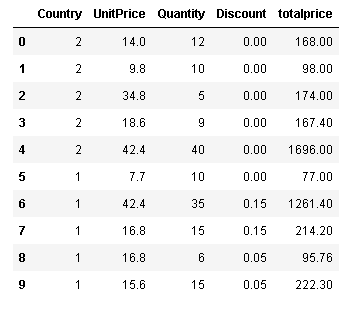

# Indroduction


Working with the Northwind Database, we will be using hypothesis testing to answer a few questions about company practice, and to make recommendations based on the conclusions of the analysis performed for each question.  Below is the Schema of our Database.


The questions we will attempt to answer are as follows:

> ### [Q1 -](#question_1) We are attempting to learn if discount amount has a statistically significant effect on the quantity of a product in an order? If so, at what level(s) of discount? 

> ### [Q2 -](#question_2) We are going to investigate the effect region has on the sales per unit. Is it more profitable to sell Locally, or Abroad?

> ### [Q3 -](#question_3) We will investigate the effect of employment length on average order total

> ### [Q4 -](#question_4) Are sales related to Employee location?

***

<a id="question_1"></a>
## Q1 - [View the Q1 Notebook](Question_1.ipynb)

### Does discount level have a significant effect on order quantity?

> __H0__ - $\mu1 == \mu2$ Mean Discount are __equal__ to Mean Order Quantity.<br>
__HA__ - $\mu1 != \mu2$ Mean Diacount are __not equal__ to Mean Order Quantity.

- If __H0__ is rejected, the levels of significance will be investigated.


From this graph we were able to clearly see that discount level has an effect on our order quantity.

```
scs.ttest_ind(disc_sample_means, non_disc_sample_means)
```
Ttest_indResult(statistic=40.549810991713066, pvalue=2.9180092809123824e-44)

With a __P Value of 0__ we can conclude that our means are not equal, thus __rejecting our null hypothesis, H0__

***
#### Part 2 - At what level is discount most significant?
After separating the data into discount levels, we performed a sampling means to normalize the data, the resulting distributions can be seen below.


We then performed a __Students T-Test__ and determined that with an effect size of .43, the 15% discount level is the most effective.

__Recomendations__  
- From these results, we recomend that all __discounts below 10 are dropped__, as they do not prove significant.
- For all products where an increase in order quantity is desired, we __recommend offering a 15% discount__.

<a id="question_2"></a>
# Q2 -  [View the Q2 Notebook](Question_2.ipynb)

### We are going to investigate the effect region has on the sales per unit. Is it more profitable to sell Locally, or Abroad?

> __H0__ - $\mu_1 == \mu_2$ Mean Region is __equal__ to Mean Unit Sales.<br>
__HA__ - $\mu_1 != \mu_2$ Mean Region is __NOT equal__ to Mean Unit Sales.

After separating the data into Regions, we ploted them to visualize the distributions.


With the data normalized, we were able to perform an Anova test.

The test revealed that we can __reject the Null H0__

__Recommendations:__
- With a probability factor of .85, Northern Europe has the most effect on sales, so focus should be aimed at Northern Europe.

***

<a id="question_3"></a>
# Q3 -  [View the Q3 Notebook](Question_3.ipynb)

### We will investigate the effect of employment length on average order total

> _H0_ - $\mu_1 == \mu_2$ Mean Employment Length is __equal__ Mean Total Price.<br>
_HA_ - $\mu_1 != \mu_2$ Mean Employment Length is __NOT equal__ Mean Sales Per Unit.

We first created a column which reflected the total price of each order.
Next we had to calculate the number of days each salesman has been with the company.


With the data normalized, we learned that the variances were not equal, so we decided to use the Kruskal-Wallis test.

the resulting p-value indicated that the data is from the same distribution
Thus, __we fail to reject the Null__

***

<a id="question_4"></a>
# Q4 - [View the Q4 Notebook](Question_4.ipynb)

####  Are sales related to Employee location?

> __H0__ - $\mu_1 == \mu_2$ Mean Employee Region is __equal__ Mean Total Price.<br>
__HA__ - $\mu_1 != \mu_2$ Mean Employee Region is __NOT equal__ Mean Total Price.


For this question, we organized the data by the salesmans country.
There are only 2 locations: USA, and Uk and we coded them numerically as shown below.



#### Conclusion
- The effect size and the power here tell us that there is a relationship between sales and region,<br>
- Employees in the USA have a greater effect on total sales than the overall sales in general
Thus, we __reject the null H0__

#### Recommendations: 
* Focus on the team in the USA, they have higher sales than the others.
* USA may be a good candidate for training new employees.


